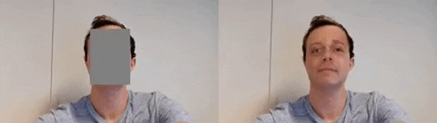
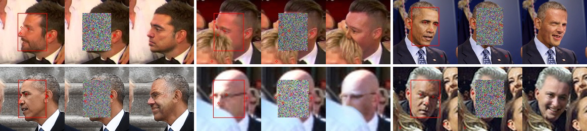

# DeepPrivacy




DeepPrivacy is a fully automatic anonymization technique for images.

This repository contains the source code for the paper [*"DeepPrivacy: A Generative Adversarial Network for Face Anonymization"*](https://arxiv.org/abs/1909.04538) published at ISVC 2019, and  [*"Image Inpainting with Learnable Feature Imputation
"*](https://arxiv.org/abs/2011.01077) published at GCPR 2020.


The DeepPrivacy GAN never sees any privacy sensitive information, ensuring a fully anonymized image. 
It utilizes bounding box annotation to identify the privacy-sensitive area, and sparse pose information to guide the network in difficult scenarios.


DeepPrivacy detects faces with state-of-the-art detection methods.
[Mask R-CNN](https://arxiv.org/abs/1703.06870) is used to generate a sparse pose information of the face, and [DSFD](https://arxiv.org/abs/1810.10220) is used to detect faces in the image.


## Information
Check out the original version here:

Check out [GCPR readme](GCPR.md) to reproduce our results from our publication "Image Inpainting with Learnable Feature Imputation".


## New features in version 2
- FP16 inference
- Support for face detection and landmark detection with a single SSD model (retinanet).
- Face alignment before anonymization - improves performance for rotate faces.
- Heavily refactored code.
- All improvements from our paper "Image Inpainting with Learnable Feature Imputation" are included.
- Support for standard image inpainting datasets (CelebA-HQ and Places2).
- Support for video inference


## Installation
Install the following: 
- Pytorch  >= 1.7.0 (Some checkpoints requires a bug fix from pytorch 1.7 - the current master branch)
- Torchvision >= 0.6.0
- NVIDIA Apex (If you want to train any models - nolt needed for inference)
- Python >= 3.6

Simply by running our `setup.py` file:

```
python3 setup.py install
```
or with pip:
```
pip install git+https://github.com/hukkelas/DeepPrivacy/
```

#### Docker
In our experiments, we use docker as the virtual environment. 

Our docker image can be built by running:
```bash
cd docker/

docker build -t deep_privacy . 
```

## Usage

We have a file command line interface to anonymize images.
```
python3 anonymize.py --source_path input_image.png --target_path output_path.png
```
You can change the model with the "-m" or "--model" flag (see model zoo).
The cli accepts image files, video files, and directories.

The cli is also available outside the folder `python -m deep_privacy.cli`.

Also check out `python -m deep_privacy.cli -h ` for more arguments.


### Webcam
Test out the model with
```
python webcam.py
```
Also check out `python webcam.py -h ` for more arguments.


## Anonymization Model Zoo
| Model | Dataset | Detector | Num parameters| 
|--|--|--|--|
|deep_privacy_v1|FDF 128x128|DSFD face detector + Mask RCNN for keypoints|46.92M|
|fdf128_rcnn512 (**recommended**)|FDF 128x128|DSFD face detector + Mask RCNN for keypoints|47.39M|
|fdf128_retinanet512|FDF 128x128|SSD-based RetinaNet with ResNet50 backbone|49.84M|
|fdf128_retinanet256|FDF 128x128|SSD-based RetinaNet with ResNet50 backbone|12.704M|
|fdf128_retinanet128|FDF 128x128|SSD-based RetinaNet with ResNet50 backbone|3.17M|

### Retinanet Detector
Combined keypoint and face detection in one single-shot model (SSD-based).
Uses five landmarks: eyes, nose, and mouth (left and right).
Model is based on [RetinaFace](https://arxiv.org/abs/1905.00641).
The model is significantly faster, but has poorer detection than DSFD.

### DSFD + RCNN
Uses [Mask R-CNN](https://arxiv.org/abs/1703.06870) is for keypoint detection, and [DSFD](https://arxiv.org/abs/1810.10220) for face detection.


## Citation
If you find this code useful, please cite the following:
```
@InProceedings{10.1007/978-3-030-33720-9_44,
author="Hukkel{\aa}s, H{\aa}kon
and Mester, Rudolf
and Lindseth, Frank",
title="DeepPrivacy: A Generative Adversarial Network for Face Anonymization",
booktitle="Advances in Visual Computing",
year="2019",
publisher="Springer International Publishing",
pages="565--578",
isbn="978-3-030-33720-9"
}


```
## FDF Dataset
The FDF dataset will be released at [github:hukkelas/FDF](https://github.com/hukkelas/FDF)


## License
All code is under MIT license, except the following. 

Code under [deep_privacy/detection](deep_privacy/detection):
- DSFD is taken from [https://github.com/hukkelas/DSFD-Pytorch-Inference](https://github.com/hukkelas/DSFD-Pytorch-Inference) and follows APACHE-2.0 License
- Mask R-CNN implementation is taken from Pytorch source code at [pytorch.org](https://pytorch.org/docs/master/torchvision/models.html#object-detection-instance-segmentation-and-person-keypoint-detection)
- FID calculation code is taken from the official tensorflow implementation: [https://github.com/bioinf-jku/TTUR](https://github.com/bioinf-jku/TTUR)
- Checkpoints published with the model follows the license of the FDF dataset.

