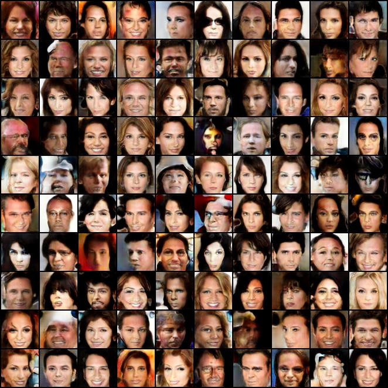

# DeepPrivacy


## Implemented from paper

1. Progressive growing (4x4 -> 1024 possible)
2. Identical network architecture 
3. Equalized learning rate
4. Pixelwise Feature Normalization
5. Mini-batch Standard Deviation
6. Auxillary information about labels (MNIST/CIFAR10)
7. WGAN-GP with epsilon penalty (From Appendix A.1)

## Differences from paper
1. Learning rate. We use 0.0002 instead of 0.001 (seems to work better with our implementation)


## TODO: 
1. Generate and train on CelebaHQ 
2. Track Inception Score and Sliced Wasserstein Distance
3. Train network on 128x128, 256x256 ++


## Current result (64x64) on original aligned CelebA


## Requirements
Pytorch >= 0.4
Python >= 3.6

## Get started (Local machine)

1. Install dependencies: 

```python
pip install -r requirements.txt
```
2. Train network

```python
python train.py
```

## Get started (Docker)

1. Build docker image file ( Done from same folder as `Dockerfile`) 

```bash
docker build -t pytorch-gpu-ext . 
```

2. Run training with docker (Launch in same folder as `train.py`)
```bash
nvidia-docker run --rm  -it -v $PWD:/app  -e CUDA_VISIBLE_DEVICES=1 pytorch-gpu-ext python train.py 
```

`CUDA_VISIBLE_DEVIES` sets what GPU to use
`coolImageName` is the docker image to use (created in step 1) 

On `telenor001` server the image `pytorch-gpu-ext` can be used as well.


# Milestones

1. Replicate Progressive - GAN
2. Train with context information

# TODO:

1. Implement CelebA
2. Implement upscaling of GAN
3. Train on generated data
